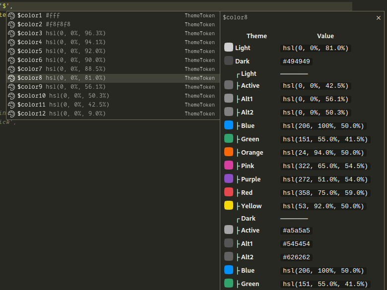
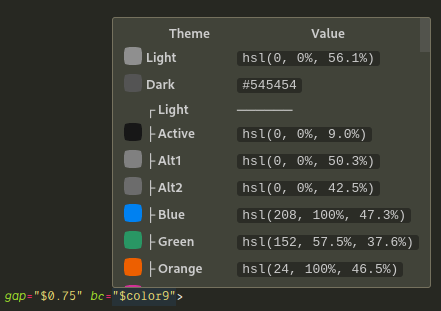
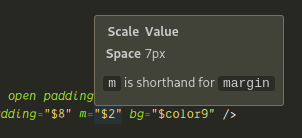

# @nderscore/tamagui-typescript-plugin

Typescript Language Server Plugin for [Tamagui](https://tamagui.dev).

## Features

- Show Tamagui theme/token values in TypeScript autocomplete suggestions

- Show Tamagui theme/token values on hover

- Graphical previews for color and theme tokens

- Automatically reloads when your config is updated by the Tamagui compiler

- Granular filtering options for autocomplete suggestions

- Smart sorting of autocomplete suggestions:

  - Tokens with numbers get sorted in numeric order

  - Negative space tokens get sorted after postive ones

  - Theme tokens always come before any Color tokens

  - Unprefixed tokens sort before scale-specific tokens (`$scale.token`)

### Screenshots

##### Theme tokens




##### Quick info on hover





##### Sorted space tokens


## Setup

1. Install `@nderscore/tamagui-typescript-plugin` package in your project:

   ```sh
   yarn add @nderscore/tamagui-typescript-plugin
   # or
   pnpm add @nderscore/tamagui-typescript-plugin
   # or
   npm add @nderscore/tamagui-typescript-plugin
   ```

1. Add plugin to your `tsconfig.json` with settings:

   ```json
   {
     "compilerOptions": {
       "plugins": [
         {
           "name": "@nderscore/tamagui-typescript-plugin",
           // all settings are optional, the defaults are shown below as an example:
           //
           // relative or absolute path to a tamagui app (parent folder of .tamagui)
           "pathToApp": "apps/next",
           //
           // the default theme to show for theme tokens when inlined
           "defaultTheme": "light",
           //
           // the size (in pixels) of color tiles in previews
           "colorTileSize": 18,
           //
           // options for filtering autocomplete suggestions
           "completionFilters": {
             // set false to hide non-theme color tokens
             "showColorTokens": true,
             // set false to hide $true and $-true size/space tokens
             "showTrueTokens": true,
             // per-scale lists of specific token names to exclude from autocomplete results
             "custom": {
               // "themeColor": [],
               // "color": [],
               // "size": [],
               // "space": [],
               // "radius": [],
               // "zIndex": []
             }
           }
         }
       ]
     }
   }
   ```

   **For monorepos:**

   In a monorepo, like the tamagui starter template, you may have multiple `tsconfig.json` for each of your workspace packages. If your packages' configurations extend from one or more base configurations, you should add the plugin to each one of those base configs and not to the individual packages.

   For the tamagui starter project, the base tsconfigs are:

   - `tsconfig.json`
   - `tsconfig.base.json`
   - `apps/next/tsconfig.json`

1. Make sure your VSCode is configured to use typescript from your workspace:

   - Open VSCode `Command Palette` -> `Select Typescript Version...` -> `Use Workspace Version`

### Usage in Expo-only (no-Next.js) Tamagui projects

Currently, the `@tamagui/babel-plugin` may not generate a `.tamagui` directory with your configuration cached inside.

If you encounter this issue, you can use a temporary workaround to generate it manually:

#### Expo-only workaround

1. Add `@tamagui/static` to your project:

   ```
   yarn add @tamagui/static
   ```

1. Create a script `generate-tamagui-json.js` and fill in with your settings if needed:

   ```js
   // generate-tamagui-json.js
   const { loadTamagui } = require('@tamagui/static');

   loadTamagui({
     config: 'tamagui.config.ts',
     components: ['tamagui'],
   });
   ```

1. Execute `node generate-tamagui-json.js` to generate a `.tamagui` directory in your Expo project folder.

   This script will need to be ran manually after changing your theme/tokens.

## Contributing

If you would like to contribute to this project, please see the [contributing guide](./CONTRIBUTING.md).
